# IBM Technology Zone Environment for IBM Business Partners

Description: This repo is made for business partners to find the most important and well-curated TechZone environments (which really work) for demoing the products of IBM to their customers  in the area of Data & AI.

Certified Base Images: We have a list in TechZone which are the most well-known and used environments from IBM, where you as business partner have also access to [link](https://techzone.ibm.com/collection/tech-zone-certified-base-images/journey-watsonx) In the tables below you find the environments categorized into products.

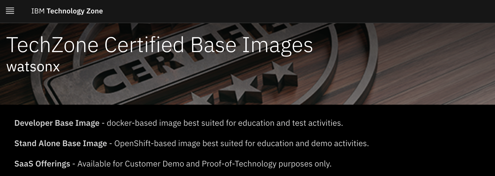

## IBM Technology Zone Environment (TechZone)

Technology Zone is the single destination for our go-to-market teams and IBM business partners ecosystem to access on-demand and live environments to learn, build, show, and share the value of IBM solutions. Additionally, they can extend our certified base images and further customize them for test, education, demonstration, and pilot activities.

## IBM Bob

| Environment | Screenshot | Value | Includes |
|-------------|------------|-------|----------|
| [IBM Bob Early Access for Client](https://forms.microsoft.com/pages/responsepage.aspx?id=V3D2_MlQ1EqY8__KZK3Z6cDXfNM5tu1HsFoldQxfyW9URVg4RkxTNFFFQ1FKNkozVVI0WEw1S0FUQi4u&route=shorturl](https://www.ibm.com/products/bob#Form)) |  | Request form to get early access to IBM Bob for Business Partners and Clients  | IBM Bob Early Access|

## watsonx.ai & watsonx.governance

| Environment | Screenshot | Value | Includes |
|-------------|------------|-------|----------|
| [watsonx.ai/.governance SaaS](https://techzone.ibm.com/my/reservations/create/64b8490a564e190017b8f4eb) | 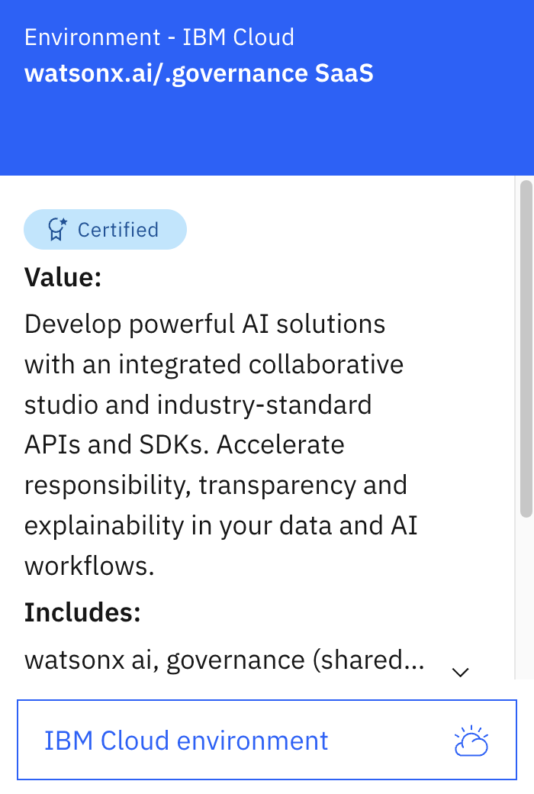 | Develop powerful AI solutions with an integrated collaborative studio and industry-standard APIs and SDKs. Accelerate responsibility, transparency and explainability in your data and AI workflows. | watsonx ai, governance (shared, no goernance console), db2, cloud object storage, Studio, Knowledge Catalog (shared)|
| [watsonx.ai/.gov Dedicated (Account Vending)](https://techzone.ibm.com/my/reservations/create/687ec5924c73567a1c4f1341) | 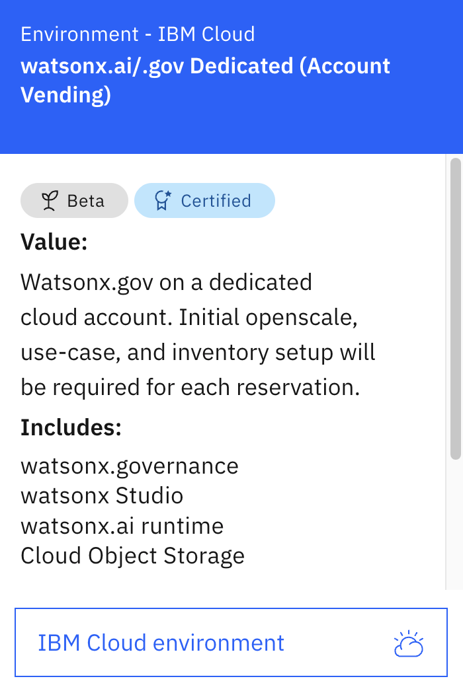 | Watsonx.gov on a dedicated cloud account. Initial openscale, use-case, and inventory setup will be required for each reservation. | watsonx.governance (no goernance console), watsonx Studio, watsonx.ai runtime, Cloud Object Storage |
| [watsonx.ai Model Gateway (preview)](https://techzone.ibm.com/my/reservations/create/686d973042dd546e27332254) | 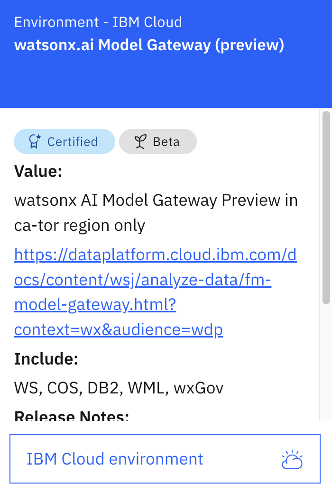 | watsonx AI [Model Gateway](https://dataplatform.cloud.ibm.com/docs/content/wsj/analyze-data/fm-model-gateway.html?context=wx&audience=wdp) Preview in ca-tor region only. | WS, COS, DB2, WML, wxGov|

## watsonx.data & data stores

| Name of TechZone Environment | Screenshot | Description | Ordering Process |
|------------------------------|------------|-------------|------------------|
| [watsonx.data Developer base image](https://techzone.ibm.com/collection/6470dc59ddb55700174b6260) | 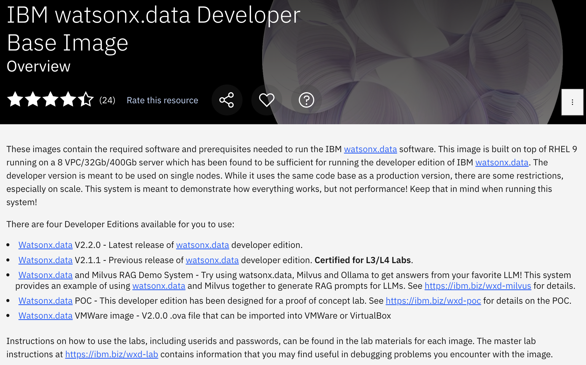 | These images contain the required software and prerequisites needed to run the IBM watsonx.data software. This image is built on top of RHEL 9 running on a 8 VPC/32Gb/400Gb server which has been found to be sufficient for running the developer edition of IBM watsonx.data. The developer version is meant to be used on single nodes. | Select one of the images by clicking on the corresponding link |
| [watsonx.data SaaS](https://techzone.ibm.com/my/reservations/create/64b8482e370b920017e0660e) | 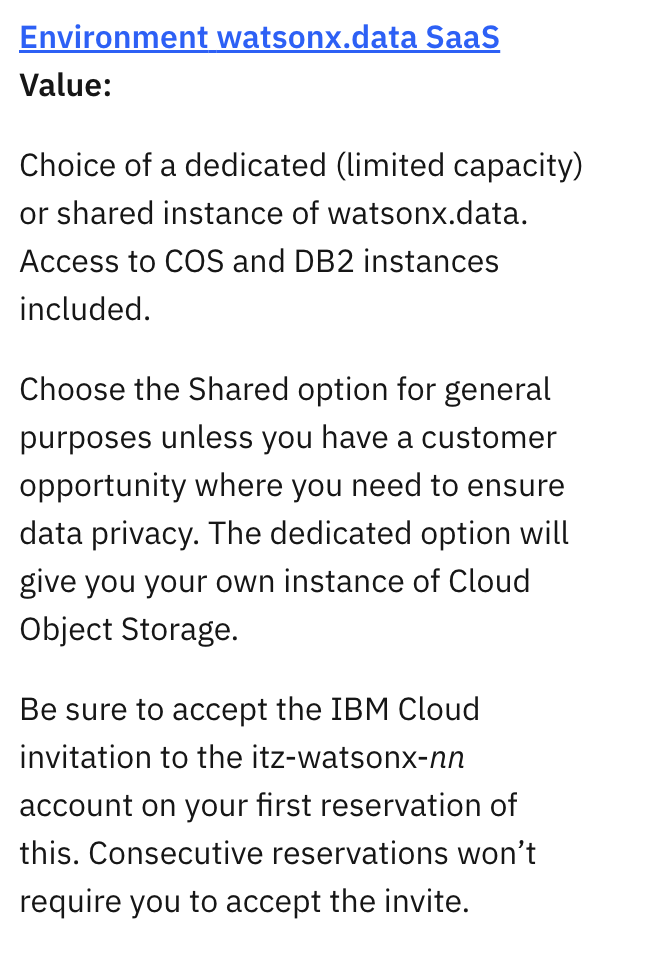 | Choice of a dedicated (limited capacity) or shared instance of watsonx.data. Access to COS and DB2 instances included. | Click on the reservation link provided. |
| [Db2 Modernization](https://techzone.ibm.com/collection/db2-modernization) | 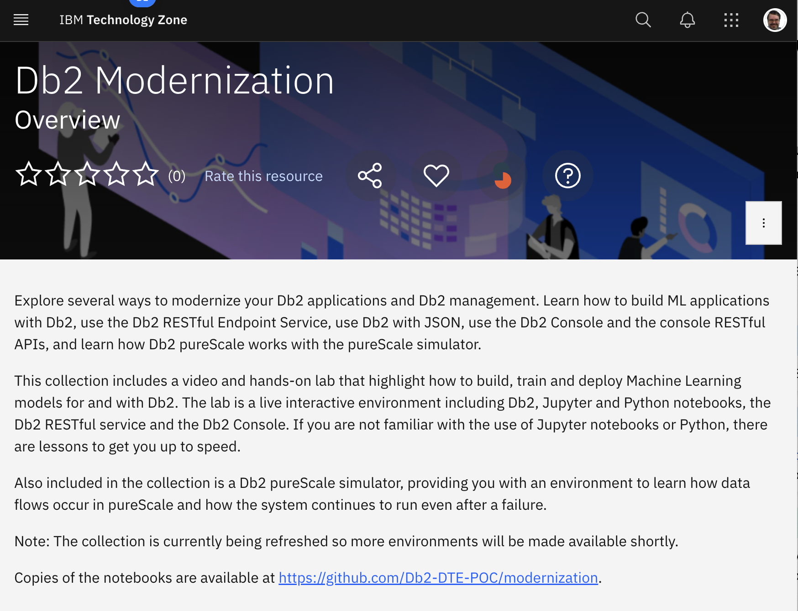 | Learn how to build ML applications with Db2, use the Db2 RESTful Endpoint Service, use Db2 with JSON, use the Db2 Console and the console RESTful APIs, and learn how Db2 pureScale works with the pureScale simulator. | Click on the link and follow the instructions. |
| [MongoDB](https://techzone.ibm.com/collection/tech-zone-certified-base-images/journey-ibm-cloud-environments) | 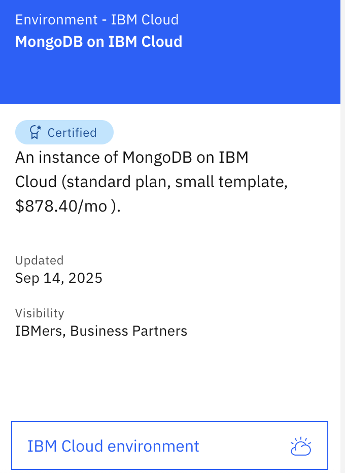 | In this environment you can try out the various features of MongoDB.| Click on the link, search for mongodb and reserve an environment |

## Watsonx Orchestrate

| Name of TechZone Environment | Screenshot | Description | Ordering Process |
|------------------------------|------------|-------------|------------------|
| [watsonx Orchestrate Trial/Standard plan Agentic for BP](https://techzone.ibm.com/my/reservations/create/66bcefdfc428e2fc24fa105f) | 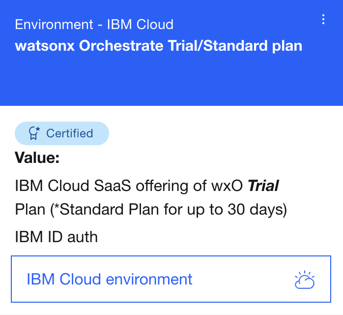 | watsonx Orchestrate trial/standard plan with agentic version for demo purposes | Click on the link to the environment to directly reservate the instance. In case of demo enter a oppty number, ortherwise choose Eductation or Test to order the instance. This is a cloud instance. You will get a mail with a status update and a email to join the cloud account, in this email, click on 'join now' to be added to the account. |
| [watsonx Orchestrate essentials plan Agentic for BP](https://techzone.ibm.com/my/reservations/create/6810e6321b5cf0f60804d767) | 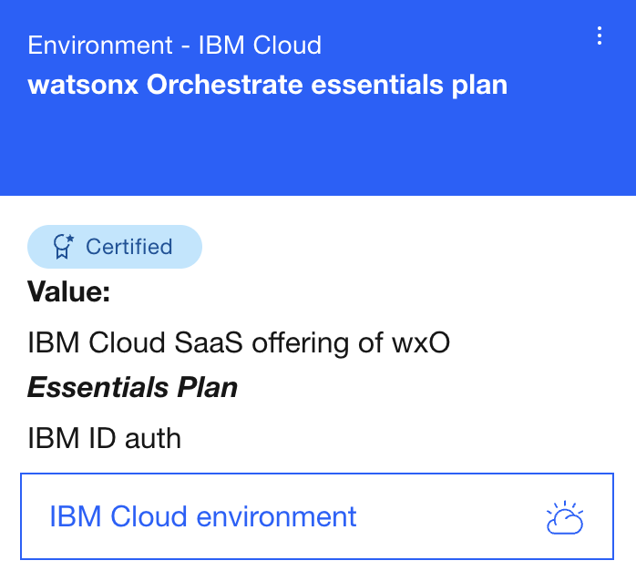 | watsonx Orchestrate essentials plan with agentic version for demo purposes | Click on the link to the environment to directly reservate the instance. In case of demo enter a oppty number, ortherwise choose Eductation or Test to order the instance. This is a cloud instance. You will get a mail with a status update and a email to join the cloud account, in this email, click on 'join now' to be added to the account. |
| [watsonx Orchestrate Agent Development Kit CLI](https://developer.watson-orchestrate.ibm.com/getting_started/installing) | 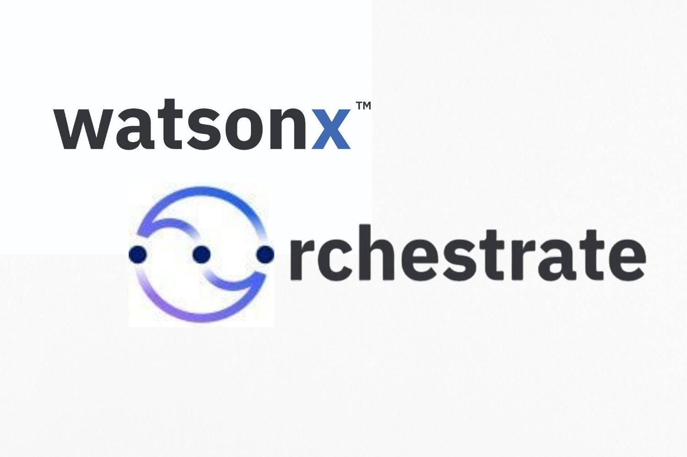 | The watsonx Orchestrate Agent Development Kit (ADK) is for interaction with a local or remote instance of watsonx Orchestrate to create custom tools to add to an agent and to create new agents. There are a lot of additional useful capabilities. Try it out now! | Click on the link to the watsonx Orchestrate ADK Documentation to get started. |
| [Demo Hub watsonx Orchestrate Agentic](https://developer.ibm.com/dsce/watsonx?tag=Agentic+AI&uc=all) |  | This is a demo hub to access pre-built demos for agentic AI use cases to show your customer examples for business cases.  | Click on that link to get to pre configured demo assets.  |

